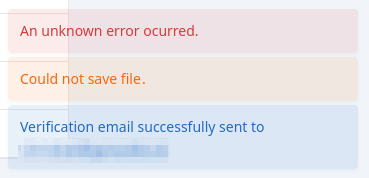
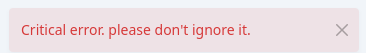

# **Toasts Component Documentation**

## **Overview**
The `Toasts` component is a Django-Tetra UI element that displays notifications using Bootstrap toasts. It listens for new messages and updates the UI dynamically. The component supports both **dismissible and auto-hidden messages**, with an optional **custom delay**.

You have to have `TetraMiddleware` installed in your `settings.MIDDLEWARE` list for Toasts to work.

##  Examples
### Standard toasts




### Dismissible toast


---

## Usage
Include the `Toasts` component in a Django (base) template:

```django

```

- The `delay` parameter is **optional**.  
- If not provided, it defaults to **8000 milliseconds (8 seconds)**.  
- This delay controls **auto-dismissal** for non-dismissible toasts.

To show a toast, just use the normal Django message framework, the rest will do Tetra for you.

```python
from django.contrib import messages 
...
messages.warning(request, "Could not save file.")
messages.error(request, "Critical error. Stop working.", extra_tags="dismissible")
messages.info(request, _("You have new mail. {link_to_mailbox}").format(link_to_mailbox=...), extra_tags="dismissible")
```

---

## **Attributes**
| Attribute  | Type  | Default        | Description                                                                                                                              |
|------------|-------|----------------|------------------------------------------------------------------------------------------------------------------------------------------|
| `delay`    | `int` | `8000`         | Default time (in milliseconds) before auto-hiding messages.                                                                              |
| `position` | `str` | `bottom-right` | Position of the message displaying. Must be one of `top_left`, `top-center`, `top-right`, `bottom-left`, `bottom-center`, `bottom-right` |


## Functionality
The `Toasts` component includes **JavaScript logic** to manage toast messages dynamically. With every request, even Tetra requests of other components, queued messages of the Django messages framework are sent to the client via the request header (`headers[T-Messages]`). The Javascript part of the component listens to that message arrival and creates / shows the messages dynamically. 

### **Key Features**
- **Handles adding and removing toasts** dynamically.
- Supports **dismissible and auto-hidden toasts**.  
- **Uses Bootstrap's `Toast` component** for animations and auto-dismissal.
- Allows **custom delay per message** or **component-wide delay**.
- **Prevents duplicate messages** by checking `uid`.

### Methods

| Method  | Description |
|---------|-------------|
| `delete_message(uid)` | Removes a message from the `messages` list by its unique ID (`uid`). |
| `add_message(message)` | Adds a new message to the `messages` list if it isn’t already present. If the message is non-dismissible, it automatically shows the toast using Bootstrap's JS API. |

To display a toast dynamically in JavaScript (should not be necessary):
```javascript
window.dispatchEvent(new CustomEvent('tetra:new-message', {
  detail: {
    uid: '12345',
    message: 'This is a test notification!',
    dismissible: true,
    tags: 'bg-success text-white'
  }
}));
```
- **`uid`**: Unique identifier to prevent duplicates. Can be anything, alphanumeric.
- **`message`**: The notification text.
- **`dismissible`**: If `true`, a close button appears, and the delay is ignored.
- **`delay`**: Delay (in ms) the message should appear before auto-hiding 
- **`tags`**: Bootstrap classes for styling.


 
